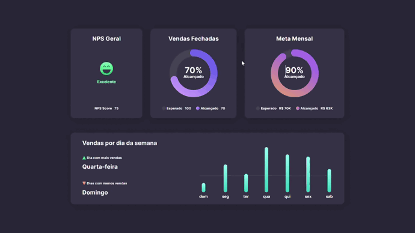

<h1 align="center">#boraCodar</h1>

  Esse projeto foi feito com base nos desafios semanais da <a href="https://www.rocketseat.com.br/">Rocketseat!</a>

  <a href="#-tecnologias">Tecnologias</a>&nbsp;&nbsp;&nbsp;|&nbsp;&nbsp;&nbsp;
  <a href="#-projeto">Projeto</a>&nbsp;&nbsp;&nbsp;&nbsp;&nbsp;&nbsp;

 

<h2>Dashboard</h2>

  

## 🚀 Tecnologias

Esse projeto foi desenvolvido com as seguintes tecnologias:

- HTML
- CSS

## 💻 Projeto

Esse projeto tinha como objetivo criar um dashboard bonitão no qual tinha como função mostrar uma "tabela" de vendas, no próprio HTML configurar manualmente, e conseguir verificar qual a porcentagem de vendas de uma loja.
